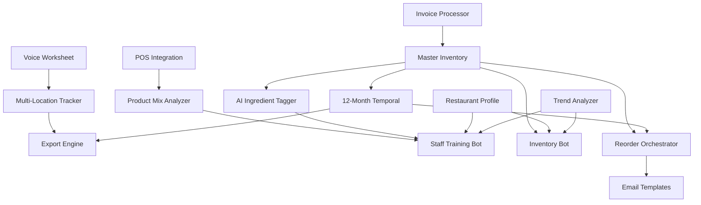

# Design Document

## Overview

The Bartender Inventory System is architected as a full-stack web application following SLC (System-Logic-Components) methodology. The system treats all features as interconnected nodes in a living, relational system where each component maintains clear boundaries while sharing data through a unified PostgreSQL schema.

**Core Philosophy:** Practical usability over perfect precision, recognizing the dynamic nature of bar operations while providing valuable insights and workflow acceleration.

**Technology Stack:**
- **Frontend:** Next.js 14+ with TypeScript, Tailwind CSS, React Hook Form
- **Backend:** Next.js API routes with tRPC for type-safe APIs
- **Database:** PostgreSQL via Supabase with Prisma ORM
- **Authentication:** Supabase Auth with passwordless magic links
- **AI Services:** Pluggable adapters for OpenAI/Anthropic (LLM), Whisper (ASR), Tesseract/Vision API (OCR)
- **Background Jobs:** Vercel Edge Functions with serverless cron
- **Deployment:** Vercel (primary), Netlify (fallback) with GitHub CI/CD

## Architecture

### SLC Node Architecture

The system is organized into 15 interconnected SLC nodes, each with defined System responsibilities, Logic flows, Components, Schema ownership, and Relational links:



### Data Flow Architecture

1. **Input Layer:** Voice counting, invoice uploads, POS imports
2. **Processing Layer:** OCR, speech recognition, data normalization
3. **Storage Layer:** PostgreSQL with real-time sync via Supabase
4. **Intelligence Layer:** AI tagging, trend analysis, reorder logic
5. **Output Layer:** Exports, chatbots, email communications

### Security Architecture

- **Authentication:** Supabase Auth with magic links
- **Authorization:** Role-based access control (Admin/Manager/Staff)
- **Data Protection:** Row-level security policies in PostgreSQL
- **Audit Logging:** Comprehensive activity tracking
- **File Security:** Upload validation with virus scanning hooks

## Components and Interfaces

### Core Data Models

```typescript
// Prisma Schema Definitions

model Ingredient {
  id                  String   @id @default(uuid())
  name               String
  supplier_id        String
  bottle_size        String
  current_price      Decimal
  category           String
  tags               String[]
  metadata           Json?    // AI-generated profiles
  par_level          Int?
  default_reorder_qty Int?
  created_at         DateTime @default(now())
  updated_at         DateTime @updatedAt
  
  supplier           Supplier @relation(fields: [supplier_id], references: [id])
  snapshots          InventorySnapshot[]
  invoice_lines      InvoiceLine[]
}

model Supplier {
  id                 String   @id @default(uuid())
  name              String
  contact_name      String?
  email             String?
  cc_emails         String[]
  email_template_id String?
  auto_send_policy  AutoSendPolicy @default(MANUAL_APPROVE)
  created_at        DateTime @default(now())
  updated_at        DateTime @updatedAt
  
  ingredients       Ingredient[]
  invoices          Invoice[]
  reorder_drafts    ReorderDraft[]
  email_template    EmailTemplate? @relation(fields: [email_template_id], references: [id])
}

model Location {
  id         String   @id @default(uuid())
  name       String   @unique
  created_at DateTime @default(now())
  
  snapshots  InventorySnapshot[]
}

model InventorySnapshot {
  id            String   @id @default(uuid())
  ingredient_id String
  location_id   String
  count         Int
  total_value   Decimal
  submitted_at  DateTime @default(now())
  
  ingredient    Ingredient @relation(fields: [ingredient_id], references: [id])
  location      Location   @relation(fields: [location_id], references: [id])
}

model Invoice {
  id           String   @id @default(uuid())
  supplier_id  String
  invoice_date DateTime
  source_file  String
  status       InvoiceStatus @default(PENDING)
  created_at   DateTime @default(now())
  
  supplier     Supplier @relation(fields: [supplier_id], references: [id])
  lines        InvoiceLine[]
}

model InvoiceLine {
  id            String   @id @default(uuid())
  invoice_id    String
  ingredient_id String?
  vendor_sku    String
  pack_size     String
  unit_price    Decimal
  purchased_qty Int
  delta         Decimal?
  
  invoice       Invoice     @relation(fields: [invoice_id], references: [id])
  ingredient    Ingredient? @relation(fields: [ingredient_id], references: [id])
}

model ReorderDraft {
  id                 String   @id @default(uuid())
  supplier_id        String
  items              Json     // Array of {ingredient_id, quantity, notes}
  additional_context String?
  status             DraftStatus @default(DRAFT)
  generated_by       GeneratedBy @default(SYSTEM)
  created_at         DateTime @default(now())
  sent_at           DateTime?
  
  supplier          Supplier @relation(fields: [supplier_id], references: [id])
}

model EmailTemplate {
  id              String   @id @default(uuid())
  name            String
  subject_template String
  body_template   String
  locale          String   @default("en")
  created_at      DateTime @default(now())
  
  suppliers       Supplier[]
}

model RestaurantProfile {
  id         String   @id @default(uuid())
  name       String
  attributes Json     // Flexible profile data
  created_at DateTime @default(now())
  updated_at DateTime @updatedAt
}

enum AutoSendPolicy {
  MANUAL_APPROVE
  AUTO_SEND_BUSINESS_HOURS
  AUTO_SEND_ALWAYS
}

enum InvoiceStatus {
  PENDING
  PROCESSED
  ERROR
}

enum DraftStatus {
  DRAFT
  SENT
  CANCELLED
}

enum GeneratedBy {
  SYSTEM
  USER
}
```

### API Interface Design

```typescript
// tRPC Router Structure

export const appRouter = router({
  // Ingredient Management
  ingredients: router({
    list: publicProcedure.query(),
    create: protectedProcedure.input(createIngredientSchema).mutation(),
    update: protectedProcedure.input(updateIngredientSchema).mutation(),
    delete: protectedProcedure.input(z.string()).mutation(),
    updateTags: protectedProcedure.input(updateTagsSchema).mutation(),
  }),

  // Inventory Operations
  inventory: router({
    createSnapshot: protectedProcedure.input(snapshotSchema).mutation(),
    getByMonth: publicProcedure.input(monthQuerySchema).query(),
    getByLocation: publicProcedure.input(locationQuerySchema).query(),
    getTotals: publicProcedure.query(),
    submitWorksheet: protectedProcedure.input(worksheetSchema).mutation(),
  }),

  // Voice Interface
  voice: router({
    processAudio: protectedProcedure.input(audioSchema).mutation(),
    confirmEntry: protectedProcedure.input(confirmationSchema).mutation(),
  }),

  // Invoice Processing
  invoices: router({
    upload: protectedProcedure.input(uploadSchema).mutation(),
    process: protectedProcedure.input(z.string()).mutation(),
    reviewDeltas: protectedProcedure.input(z.string()).query(),
    approveChanges: protectedProcedure.input(approvalSchema).mutation(),
  }),

  // POS Integration
  pos: router({
    import: protectedProcedure.input(posImportSchema).mutation(),
    mapProducts: protectedProcedure.input(mappingSchema).mutation(),
  }),

  // Export Functions
  export: router({
    excel: protectedProcedure.input(exportSchema).mutation(),
    csv: protectedProcedure.input(exportSchema).mutation(),
  }),

  // Chatbot Interfaces
  bots: router({
    training: router({
      ask: publicProcedure.input(chatSchema).mutation(),
      getRecommendations: publicProcedure.input(productQuerySchema).query(),
    }),
    inventory: router({
      getOverstockSuggestions: publicProcedure.query(),
      suggestSpecials: publicProcedure.input(overstockSchema).mutation(),
    }),
  }),

  // Reorder Management
  reorder: router({
    computeBelowPar: protectedProcedure.query(),
    createDrafts: protectedProcedure.mutation(),
    listOutbox: protectedProcedure.query(),
    sendEmail: protectedProcedure.input(sendEmailSchema).mutation(),
    updateDraft: protectedProcedure.input(updateDraftSchema).mutation(),
  }),

  // Restaurant Profile
  profile: router({
    get: publicProcedure.query(),
    update: protectedProcedure.input(profileSchema).mutation(),
    magicRefresh: protectedProcedure.input(z.string()).mutation(),
  }),
});
```

### Component Architecture

```typescript
// Frontend Component Structure

// Pages
pages/
├── index.tsx                 // Dashboard
├── login.tsx                // Authentication
├── inventory/
│   ├── worksheet.tsx        // Voice counting interface
│   └── history.tsx          // 12-month view
├── invoices/
│   ├── upload.tsx           // Invoice processing
│   └── review.tsx           // Delta review queue
├── export.tsx               // Export interface
├── bots/
│   ├── training.tsx         // Staff training chat
│   └── inventory.tsx        // Inventory management chat
├── reorder/
│   └── outbox.tsx          // Reorder draft management
└── settings/
    ├── suppliers.tsx        // Supplier management
    ├── templates.tsx        // Email templates
    ├── locations.tsx        // Location configuration
    └── profile.tsx          // Restaurant profile

// Components
components/
├── ui/                      // Shadcn/ui components
├── forms/                   // Form components with validation
├── voice/
│   ├── VoiceRecorder.tsx   // Speech recognition
│   ├── ConfirmationReader.tsx // Text-to-speech
│   └── WorksheetGrid.tsx   // Inventory grid
├── export/
│   └── ExportBuilder.tsx   // Export configuration
├── chat/
│   ├── ChatInterface.tsx   // Unified chat component
│   └── MessageBubble.tsx   // Message display
├── reorder/
│   ├── DraftEditor.tsx     // Email draft editing
│   └── OutboxList.tsx      // Draft management
└── admin/
    ├── UserManagement.tsx  // Role management
    └── AuditLog.tsx        // Activity logging
```

## Data Models

### Core Entity Relationships

1. **Ingredient** - Central entity linking to suppliers, snapshots, and invoices
2. **Supplier** - Manages vendor relationships and communication preferences
3. **Location** - Defines storage areas for multi-location tracking
4. **InventorySnapshot** - Time-series data for 12-month tracking
5. **Invoice/InvoiceLine** - Invoice processing and price delta detection
6. **ReorderDraft** - Automated reorder communication management

### Data Validation Schema

```typescript
// Zod validation schemas

export const createIngredientSchema = z.object({
  name: z.string().min(1).max(255),
  supplier_id: z.string().uuid(),
  bottle_size: z.string().min(1),
  current_price: z.number().positive(),
  category: z.string().min(1),
  tags: z.array(z.string()).optional(),
  par_level: z.number().int().positive().optional(),
  default_reorder_qty: z.number().int().positive().optional(),
});

export const snapshotSchema = z.object({
  ingredient_id: z.string().uuid(),
  location_id: z.string().uuid(),
  count: z.number().int().min(0),
  total_value: z.number().min(0),
});

export const worksheetSchema = z.object({
  snapshots: z.array(snapshotSchema),
  submitted_at: z.date().optional(),
});
```

## Error Handling

### Error Categories

1. **Validation Errors** - Input validation failures with user-friendly messages
2. **Processing Errors** - OCR, speech recognition, or AI service failures
3. **Integration Errors** - POS import or external API failures
4. **System Errors** - Database connectivity or infrastructure issues

### Error Recovery Strategies

- **Graceful Degradation** - Core functionality remains available during AI service outages
- **Retry Logic** - Exponential backoff for transient failures
- **Fallback Options** - Manual entry when automated processing fails
- **User Notification** - Clear error messages with suggested actions

## Testing Strategy

### Unit Testing
- **Data Models** - Prisma schema validation and relationships
- **Business Logic** - Reorder calculations, price delta detection
- **Utilities** - Data transformation and validation functions

### Integration Testing
- **API Endpoints** - tRPC procedure testing with mock data
- **Database Operations** - Prisma query testing
- **External Services** - AI service adapter testing with mocks

### End-to-End Testing
- **Voice Workflow** - Complete inventory counting process
- **Invoice Processing** - Upload to price update workflow
- **Reorder Generation** - Par level detection to email sending

### Performance Testing
- **Database Queries** - Optimization for large datasets
- **File Processing** - Invoice OCR and POS import performance
- **Concurrent Users** - Multi-user inventory counting scenarios

## Deployment Architecture

### Vercel Deployment (Primary)

```typescript
// vercel.json configuration
{
  "functions": {
    "pages/api/**/*.ts": {
      "runtime": "nodejs18.x"
    }
  },
  "env": {
    "DATABASE_URL": "@database_url",
    "SUPABASE_URL": "@supabase_url",
    "SUPABASE_ANON_KEY": "@supabase_anon_key",
    "OPENAI_API_KEY": "@openai_api_key",
    "SMTP_HOST": "@smtp_host",
    "SMTP_USER": "@smtp_user",
    "SMTP_PASS": "@smtp_pass"
  },
  "crons": [
    {
      "path": "/api/cron/reorder-check",
      "schedule": "0 9 * * 1-5"
    },
    {
      "path": "/api/cron/trend-analysis",
      "schedule": "0 2 * * *"
    }
  ]
}
```

### Environment Configuration

```bash
# .env.example
DATABASE_URL="postgresql://..."
SUPABASE_URL="https://..."
SUPABASE_ANON_KEY="..."
SUPABASE_SERVICE_ROLE_KEY="..."
OPENAI_API_KEY="sk-..."
WHISPER_API_KEY="..."
TESSERACT_API_KEY="..."
SMTP_HOST="smtp...."
SMTP_PORT="587"
SMTP_USER="..."
SMTP_PASS="..."
NEXTAUTH_SECRET="..."
NEXTAUTH_URL="http://localhost:3000"
```

### CI/CD Pipeline

```yaml
# .github/workflows/deploy.yml
name: Deploy to Vercel
on:
  push:
    branches: [main]
  pull_request:
    branches: [main]

jobs:
  test:
    runs-on: ubuntu-latest
    steps:
      - uses: actions/checkout@v3
      - uses: actions/setup-node@v3
      - run: npm ci
      - run: npm run lint
      - run: npm run type-check
      - run: npm run test
      - run: npx prisma generate
      - run: npm run build

  deploy:
    needs: test
    runs-on: ubuntu-latest
    if: github.ref == 'refs/heads/main'
    steps:
      - uses: actions/checkout@v3
      - uses: amondnet/vercel-action@v20
        with:
          vercel-token: ${{ secrets.VERCEL_TOKEN }}
          vercel-org-id: ${{ secrets.ORG_ID }}
          vercel-project-id: ${{ secrets.PROJECT_ID }}
```

This design provides a comprehensive technical foundation that translates all requirements into a scalable, maintainable system architecture following SLC principles while ensuring practical usability for bar operations.